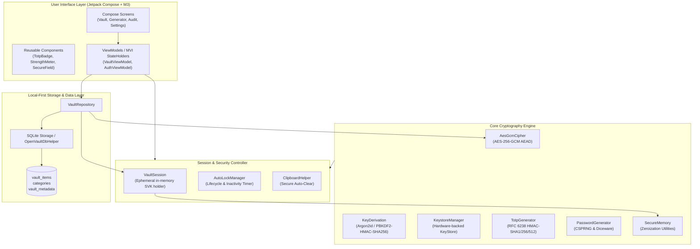
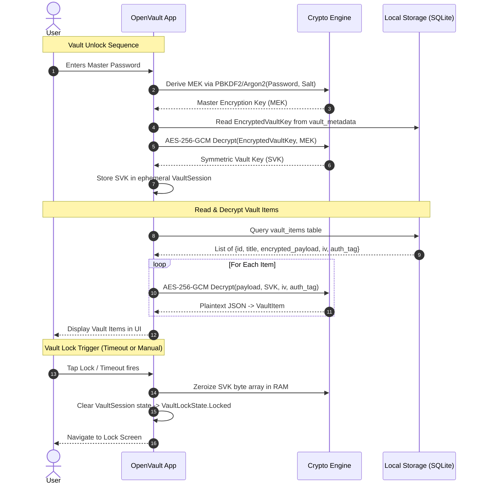

# OpenVault Architecture Documentation

This document describes the high-level software architecture, data flow, component boundaries, and security model of the **OpenVault** Android application.

---

## 1. Architectural Layers & Separation of Concerns

OpenVault follows **Clean Architecture** principles strictly separated into distinct layers:

### 1.1 UI & Presentation Layer (`org.openvault.ui`)
* **Jetpack Compose & Material Design 3:** Modern, declarative UI implementing responsive design, dark/light themes, dynamic color, and accessible typography.
* **MVI / Unidirectional Data Flow:** ViewModels expose immutable `StateFlow<ViewState>` and consume discrete `UserIntent` actions. UI never executes business or cryptographic logic directly.
* **Window Security (`FLAG_SECURE`):** Sensitive activities and dialogs enforce Android `WindowManager.LayoutParams.FLAG_SECURE` to block OS screenshots, screen mirroring, and thumbnail caching in the Android Recent Apps switcher.

### 1.2 Session & Security Layer (`org.openvault.core.security`)
* **`VaultSession`:** An ephemeral in-memory state holder that maintains the decrypted 256-bit Symmetric Vault Key (SVK). When locked, the key buffer is proactively wiped via `Arrays.fill(..., 0)` and garbage-collected.
* **`AutoLockManager`:** Observes `ProcessLifecycleOwner` and user inactivity events. Locks the vault immediately or after a user-configured timeout (e.g., 1 min, 5 min, screen off).
* **`ClipboardHelper`:** When passwords or TOTP codes are copied, sets Android 13+ `ClipDescription.EXTRA_IS_SENSITIVE` and launches a coroutine timer to purge clipboard content after 30s or 60s.

### 1.3 Cryptography Layer (`org.openvault.core.crypto`)
* **No Invented Cryptography:** Strictly uses standard, audited algorithms and primitives:
  * **AES-256-GCM (NIST SP 800-38D):** Authenticated encryption with associated data (AEAD) using random 12-byte IVs and 128-bit MAC tags.
  * **PBKDF2-HMAC-SHA256 (RFC 2898 / RFC 8018):** 600,000 rounds with 32-byte cryptographic salt.
  * **Argon2id (RFC 9106):** Memory-hard key derivation for defense against GPU/ASIC attacks.
  * **RFC 6238 TOTP:** Standard time-based one-time passwords supporting SHA-1, SHA-256, and SHA-512 with 30s/60s steps.
  * **`SecureRandom`:** High-entropy cryptographically secure pseudo-random number generator for password generation, salts, and initialization vectors.
  * **`SecureMemory`:** Utilities for immediate zeroization of sensitive arrays (`CharArray`, `ByteArray`).

### 1.4 Persistence Layer (`org.openvault.core.database` & `org.openvault.data`)
* **Local-First SQLite Storage:** Fast, reliable, zero-cloud dependency.
* **Field-Level Encryption:** Sensitive fields (username, password, URL, notes, custom fields, TOTP secrets) are packaged in a JSON payload and encrypted into ciphertext blobs before hitting disk.
* **Tombstone Sync Ready:** All entities feature revision timestamps and soft-delete flags to enable conflict-free synchronization (LWW-Element-Set) if future encrypted peer-to-peer sync is enabled.

---

## 2. Zero-Knowledge Data Flow

---

## 3. Threat Mitigation Summary

1. **Storage Extraction:** If a device is rooted or physically extracted, the SQLite database reveals only encrypted payloads. Without the master password or Keystore authorization, payloads cannot be decrypted.
2. **Brute Force:** 600,000 rounds of PBKDF2-HMAC-SHA256 or Argon2id with 32-byte salt render offline dictionary attacks computationally prohibitive.
3. **Clipboard Interception:** Sensitive clipboard data is marked sensitive and automatically cleared after 30 seconds.
4. **Window Snooping:** Window `FLAG_SECURE` prevents rogue background screen recorders and Android recent-apps thumbnails from capturing plaintext.
